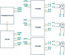
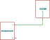
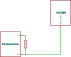
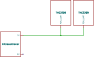
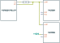
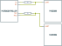
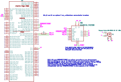
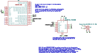

- [Library Information](#org90c2955)
- [Stepper Motors](#org70e9129)
- [Stepper Motor Controllers and Drivers](#org3801345)
- [Communication](#org76570a9)
- [Settings](#orgc9473ce)
- [Examples](#org66b2186)
- [Hardware Documentation](#org733ac67)
- [Host Computer Setup](#org52dc625)

    <!-- This file is generated automatically from metadata -->
    <!-- File edits may be overwritten! -->


<a id="org90c2955"></a>

# Library Information

-   **Name:** TMC2209
-   **Version:** 9.0.10
-   **License:** BSD
-   **URL:** <https://github.com/janelia-arduino/TMC2209>
-   **Author:** Peter Polidoro
-   **Email:** peter@polidoro.io


## Description

The TMC2209 is an ultra-silent motor driver IC for two phase stepper motors with both UART serial and step and direction interfaces.


<a id="org70e9129"></a>

# Stepper Motors

From Wikipedia, the free encyclopedia:

A stepper motor, also known as step motor or stepping motor, is a brushless DC electric motor that divides a full rotation into a number of equal steps. The motor's position can be commanded to move and hold at one of these steps without any position sensor for feedback (an open-loop controller), as long as the motor is correctly sized to the application in respect to torque and speed.

[Wikipedia - Stepper Motor](https://en.wikipedia.org/wiki/Stepper_motor)


<a id="org3801345"></a>

# Stepper Motor Controllers and Drivers

Stepper motors need both a controller and a driver. These may be combined into a single component or separated into multiple components that communicate with each other, as is the case with the TMC2209 stepper motor driver. One controller may be connected to more than one driver for coordinated multi-axis motion control.


## Stepper Motor Controller

A stepper motor controller is responsible for the commanding either the motor kinetics, the torque, or the motor kinematics, the position, speed, and acceleration of one or more stepper motors.


## Stepper Motor Driver

A stepper motor driver is responsible for commanding the electrical current through the motor coils as it changes with time to meet the requirements of the stepper motor controller.


## TMC2209 Stepper Motor Driver and Controller Combination

The TMC2209 is a stepper motor driver and it needs a stepper motor controller communicating with it.

The TMC2209 can be used as both a stepper motor driver and stepper motor controller combined, independent from a separate stepper motor controller, but it is limited to simple velocity control mode only, with no direct position or acceleration control.

In velocity control mode, the velocity of the motor is set by the method moveAtVelocity(int32\_t microsteps\_per\_period). The actual magnitude of the velocity depends on the TMC2209 clock frequency. The TMC2209 clock frequency (fclk) is normally 12 MHz if the internal clock is used, but can be between 4 and 16 MHz if an external clock is used.

In general: microsteps\_per\_second = microsteps\_per\_period \* (fclk Hz / 2^24)

Using internal 12 MHz clock (default): microsteps\_per\_second = microsteps\_per\_period \* 0.715 Hz

Crude position control can be performed in this simple velocity control mode by commanding the driver to move the motor at a velocity, then after a given amount of time commanding it to stop, but small delays in the system will cause position errors. Plus without acceleration control, the stepper motor may also slip when it attempts to jump to a new velocity value causing more position errors. For some applications, these position errors may not matter, making simple velocity control good enough to save the trouble and expense of adding a separate stepper controller.

Many of this library's examples use the simple velocity control mode to test the driver independently from a separate stepper motor controller, however in most real world applications a separate motor controller is needed, along with the TMC2209 and this library, for position and acceleration control.


### Microcontroller Stepper Motor Controller

One controller option is to use just a single microcontroller, communicating with the TMC2209 over both the UART serial interface and the step and direction interface.


### TMC429 and Microcontroller Stepper Motor Controller

Another controller option is to use both a microcontroller and a separate step and direction controller, such as the TMC429.




<a id="org76570a9"></a>

# Communication

The TMC2209 driver has two interfaces to communicate with a stepper motor controller, a UART serial interface and a step and direction interface.

The UART serial interface may be used for tuning and control options, for diagnostics, and for simple velocity commands.

The step and direction interface may be used for real-time position, velocity, and acceleration commands. The step and direction signals may be synchronized with the step and direction signals to other stepper drivers for coordinated multi-axis motion.


## UART Serial Interface

[Wikipedia - UART](https://en.wikipedia.org/wiki/Universal_asynchronous_receiver-transmitter)

The TMC2209 communicates over a UART serial port using a single wire interface, allowing either unidirectional communication, for parameter setting only, or for bidirectional communication allowing full control and diagnostics. It can be driven by any standard microcontroller UART or even by bit banging in software.


### Unidirectional Communication

TMC2209 parameters may be set using unidirectional communication from a microcontroller UART serial TX pin to the TMC2209 PDN\_UART pin. Responses from the TMC2209 to the microcontroller are ignored.




### Bidirectional Communication

The UART single wire interface allows control of the TMC2209 with any set of microcontroller UART serial TX and RX pins.

1.  Coupled

    The simpliest way to connect the single TMC2209 serial signal to both the microcontroller TX pin and RX pin is to use a 1k resistor between the TX pin and the RX pin to separate them.
    
    Coupling the TX and RX lines together has the disadvantage of echoing all of the TX commands from the microcontroller to the TMC2209 on the microcontroller RX line. These echos need to be removed by this library in order to properly read responses from the TMC2209.
    
    Another disadvantage to coupling the TX and RX lines together is that it limits the length of wire between the microcontroller and the TMC2209. The TMC2209 performs a CRC (cyclic redundancy check) which helps increase interface distances while decreasing the risk of wrong or missed commands even in the event of electromagnetic disturbances.
    
    


### Serial Setup

The microcontroller serial port must be specified during the TMC2209 setup.

Microcontroller serial ports may either be implemented in hardware or software.

Hardware serial ports use dedicated hardware on the microcontroller to perform serial UART communication.

Software serial ports allow serial communication on other microcontroller digital pins that do not have dedicated UART hardware by replicating the functionality in software.

Hardware serial ports should always be preferred over software serial ports. Software serial ports have many performance limitations, such as not allowing transmitting and receiving data at the same time, lower baud rates, and using software serial ports may affect performance of other code running on the microcontroller.

Not all platforms implement SoftwareSerial, for example ESP32 and SAMD\_SERIES. If any other platforms fail to compile because SoftwareSerial cannot be found, please submit an issue saying which platform fails.

1.  Hardware Serial Setup

    ```cpp
    #include <TMC2209.h>
    
    
    // Instantiate TMC2209
    TMC2209 stepper_driver;
    
    HardwareSerial & serial_stream = Serial1;
    
    void setup()
    {
      stepper_driver.setup(serial_stream);
    }
    ```

2.  Hardware Serial Setup with Alternate RX and TX pins

    Some microcontrollers (e.g. ESP32) allow alternative hardware serial RX and TX pins.
    
    ```cpp
    #include <TMC2209.h>
    
    
    // Instantiate TMC2209
    TMC2209 stepper_driver;
    
    HardwareSerial & serial_stream = Serial1;
    const long SERIAL_BAUD_RATE = 115200;
    const int RX_PIN = 5;
    const int TX_PIN = 26;
    
    void setup()
    {
      stepper_driver.setup(serial_stream, SERIAL_BAUD_RATE, TMC2209::SERIAL_ADDRESS_0, RX_PIN, TX_PIN);
    }
    ```

3.  Software Serial Setup

    ```cpp
    #include <TMC2209.h>
    
    
    // Instantiate TMC2209
    TMC2209 stepper_driver;
    
    // Software serial ports should only be used for unidirectional communication
    // The RX pin does not need to be connected, but it must be specified when
    // creating an instance of a SoftwareSerial object
    const int RX_PIN = 0;
    const int TX_PIN = 1;
    SoftwareSerial soft_serial(RX_PIN, TX_PIN);
    
    void setup()
    {
      stepper_driver.setup(soft_serial);
    }
    ```


### Arduino Serial

[Arduino Serial Web Page](https://www.arduino.cc/reference/en/language/functions/communication/serial)

On some Arduino boards (e.g. Uno, Nano, Mini, and Mega) pins 0 and 1 are used for communication with the computer on the serial port named "Serial". Pins 0 and 1 cannot be used on these boards to communicate with the TMC2209. Connecting anything to these pins can interfere with that communication, including causing failed uploads to the board.

Arduino boards with additional hardware serial ports, such as "Serial1" and "Serial2", can use those ports to communicate with the TMC2209.


### Teensy Serial

[Teensy Serial Web Page](https://www.pjrc.com/teensy/td_uart.html)

The Teensy boards have 1 to 8 hardware serial ports (Serial1 - Serial8), which may be used to connect to serial devices.

Unlike Arduino boards, the Teensy USB serial interface is not connected to pins 0 and 1, allowing pins 0 and 1 to be used to communicate with a TMC2209 using "Serial1".


### Serial Baud Rate

The serial baud rate is the speed of communication in bits per second of the UART serial port connected to the TMC2209.

In theory, baud rates from 9600 Baud to 500000 Baud or even higher (when using an external clock) may be used. No baud rate configuration on the chip is required, as the TMC2209 automatically adapts to the baud rate. In practice, it was found that the baud rate may range from 19200 to 500000 without errors when using hardware serial ports. Software serial ports use a default baud rate of 9600.

The higher the baud rate the better, but microcontrollers have various UART serial abilities and limitations which affects the maximum baud allowed. The baud rate may be specified when setting up the stepper driver.

1.  Arduino

    The maximum serial baud rate on typical Arduino boards is 115200, so that is the default when using hardware serial ports, but other values as low as 19200 may be used.
    
    <https://www.arduino.cc/reference/en/language/functions/communication/serial/>

2.  Teensy

    Teensy UART baud rates can go higher than many typical Arduino boards, so 500k is a good setting to use, but other values as low as 19200 may be used.
    
    [Teensy Serial Baud Rate Web Page](https://www.pjrc.com/teensy/td_uart.html)
    
    ```cpp
    #include <TMC2209.h>
    
    // Instantiate TMC2209
    TMC2209 stepper_driver;
    HardwareSerial & serial_stream = Serial1;
    const long SERIAL_BAUD_RATE = 500000;
    
    void setup()
    {
      stepper_driver.setup(Serial1, SERIAL_BAUD_RATE);
    }
    ```


### Connecting multiple TMC2209 chips

1.  Unidirectional Communication

    1.  All chips using identical settings
    
        If only unidirectional communication is desired and all TMC2209 chips connected to the same serial line will have identical settings, then no serial addressing is required. All chips can be programmed in parallel like a single device.
        
        ```cpp
        #include <TMC2209.h>
        
        // Instantiate a single TMC2209 to talk to multiple chips
        TMC2209 stepper_drivers;
        
        void setup()
        {
          stepper_drivers.setup(Serial1);
        }
        ```
        
        
    
    2.  Chips needing different settings using one UART
    
        ```cpp
        #include <TMC2209.h>
        
        // Instantiate the two TMC2209
        TMC2209 stepper_driver_0;
        const TMC2209::SerialAddress SERIAL_ADDRESS_0 = TMC2209::SERIAL_ADDRESS_0;
        TMC2209 stepper_driver_1;
        const TMC2209::SerialAddress SERIAL_ADDRESS_1 = TMC2209::SERIAL_ADDRESS_1;
        const long SERIAL_BAUD_RATE = 115200;
        
        void setup()
        {
          // TMC2209::SERIAL_ADDRESS_0 is used by default if not specified
          stepper_driver_0.setup(Serial1, SERIAL_BAUD_RATE, SERIAL_ADDRESS_0);
          stepper_driver_1.setup(Serial1, SERIAL_BAUD_RATE, SERIAL_ADDRESS_1);
        }
        ```
        
        
    
    3.  Chips needing different settings using multiple UART
    
        ```cpp
        #include <TMC2209.h>
        
        // Instantiate the two TMC2209
        TMC2209 stepper_driver_0;
        TMC2209 stepper_driver_1;
        const long SERIAL_BAUD_RATE = 115200;
        
        void setup()
        {
          stepper_driver_0.setup(Serial1, SERIAL_BAUD_RATE);
          stepper_driver_1.setup(Serial2, SERIAL_BAUD_RATE);
        }
        ```
        
        

2.  Bidirectional Communication

    1.  Chips needing different settings using one UART
    
        More than one TMC2209 may be connected to a single serial port, if each TMC2209 is assigned a unique serial address. The default serial address is "SERIAL\_ADDRESS\_0". The serial address may be changed from "SERIAL\_ADDRESS\_0" using the TMC2209 hardware input pins MS1 and MS2, to "SERIAL\_ADDRESS\_1", "SERIAL\_ADDRESS\_2", or "SERIAL\_ADDRESS\_3".
        
        The TMC2209 serial address must be specified during the TMC2209 setup, if it is not equal to the default of "SERIAL\_ADDRESS\_0".
        
        When multiple TMC2209 chips are connected to the same serial line with multiple addresses then the reply delay value should be increased, otherwise a non-addressed chip might detect a transmission error upon read access to a different chip.
        
        ```cpp
        #include <TMC2209.h>
        
        // Instantiate the two TMC2209
        TMC2209 stepper_driver_0;
        const TMC2209::SerialAddress SERIAL_ADDRESS_0 = TMC2209::SERIAL_ADDRESS_0;
        TMC2209 stepper_driver_1;
        const TMC2209::SerialAddress SERIAL_ADDRESS_1 = TMC2209::SERIAL_ADDRESS_1;
        const uint8_t REPLY_DELAY = 4;
        const long SERIAL_BAUD_RATE = 115200;
        
        void setup()
        {
          // TMC2209::SERIAL_ADDRESS_0 is used by default if not specified
          stepper_driver_0.setup(Serial1,SERIAL_BAUD_RATE,SERIAL_ADDRESS_0);
          stepper_driver_0.setReplyDelay(REPLY_DELAY);
          stepper_driver_1.setup(Serial1,SERIAL_BAUD_RATE,SERIAL_ADDRESS_1);
          stepper_driver_1.setReplyDelay(REPLY_DELAY);
        }
        ```
        
        
    
    2.  Chips needing different settings using multiple UART
    
        ```cpp
        #include <TMC2209.h>
        
        // Instantiate the two TMC2209
        TMC2209 stepper_driver_0;
        TMC2209 stepper_driver_1;
        const long SERIAL_BAUD_RATE = 115200;
        
        void setup()
        {
          stepper_driver_0.setup(Serial1, SERIAL_BAUD_RATE);
          stepper_driver_1.setup(Serial2, SERIAL_BAUD_RATE);
        }
        ```
        
        


## Step and Direction Interface


### Microcontroller Stepper Motor Controller

The step and direction signals may be output from a microcontroller, using one output pin for the step signal and another output pin for the direction signal.


### TMC429 and Microcontroller Stepper Motor Controller

The step and direction signals may be output from a dedicated step and direction controller, such as the TMC429.

A library such as the Arduino TMC429 library may be used to control the step and direction output signals.

[Arduino TMC429 Library](https://github.com/janelia-arduino/TMC429)


<a id="orgc9473ce"></a>

# Settings

The default settings for this library are not the same as the default settings for the TMC2209 chip during power up.

The default settings for this library were chosen to be as conservative as possible so that motors can be attached to the chip without worry that they will accidentally overheat from too much current before library settings can be changed.

These default settings may cause this library to not work properly with a particular motor until the settings are changed.

The driver starts off with the outputs disabled, with the motor current minimized, with analog current scaling disabled, and both the automatic current scaling and automatic gradient adaptation disabled, and the cool step feature disabled.

Change driver settings with care as they may cause the motors, wires, or driver to overheat and be damaged when the current is too high. The driver tends to protect itself and shutdown when it overheats, then reenable when the driver cools, which can result in odd jerky motor motion.


## Driver Enable

The driver is disabled by default and must be enabled before use.

The driver may be disabled in two ways, either in hardware or in software, and the driver must be enabled in both ways in order to drive a motor.

To enable the driver in software, or optionally in both hardware and software, use the enable() method.

To disable the driver in software, or optionally in both hardware and software, use the disable() method.


### Hardware Enable

The TMC2209 chip has an enable input pin that switches off the power stage, all motor outputs floating, when the pin is driven to a high level, independent of software settings.

The chip itself is hardware enabled by default, but many stepper driver boards pull the enable input pin high, which causes the driver to be disabled by default.

To hardware enable the driver using this library, use the setHardwareEnablePin method to assign a microcontroller pin to contol the TMC2209 enable line.

To hardware enable the driver without using this library, pull the enable pin low, either with a jumper or with an output pin from the microcontroller.

The method hardwareDisabled() can be used to tell if the driver is disabled in hardware.


### Software Enable

The TMC2209 may also be enabled and disabled in software, independent of the hardware enable pin.

When the driver is disabled in software it behaves the same as being disabled by the hardware enable pin, the power stages are switched off and all motor outputs are floating.

This library disables the driver in software by default.


## Analog Current Scaling

Analog current scaling is disabled in this library by default, so a potentiometer connected to VREF will not set the current limit of the driver. Current settings are controlled by UART commands instead.

Use enableAnalogCurrentScaling() to allow VREF, the analog input of the driver, to be used for current control.

According to the datasheet, modifying VREF or the supply voltage invalidates the result of the automatic tuning process. So take care when attempting to use analog current scaling with automatic tuning at the same time.


## Automatic Tuning

The TMC2209 can operate in one of two modes, the voltage control mode and the current control mode.

In both modes, the driver uses PWM (pulse width modulation) to set the voltage on the motor coils, which then determines how much current flows through the coils. In voltage control mode, the driver sets the PWM based only on the driver settings and the velocity of the motor. In current control mode, the driver uses driver settings and the velocity to set the PWM as well, but in addition it also measures the current through the coils and adjusts the PWM automatically in order to maintain the proper current levels in the coils.

Voltage control mode is the default of this library.

The datasheet recommends using current control mode unless the motor type, the supply voltage, and the motor load, the operating conditions, are well known. This library uses voltage control mode by default, though, because there seem to be cases when the driver is unable to calibrate the motor properties properly and that can cause the motor to overheat before the settings are adjusted.

The datasheet explains how to make sure the driver performs the proper automatic tuning routine in order to use current control mode.

Use enableAutomaticCurrentScaling() to switch to current control mode instead.


### Voltage Control Mode

Use disableAutomaticCurrentScaling() to switch to voltage control mode and disable automatic tuning.

When automatic current scaling is disabled, the driver operates in a feed forward velocity-controlled mode and will not react to a change of the supply voltage or to events like a motor stall, but it provides a very stable amplitude.

When automatic tuning is disabled, the run current and hold current settings are not enforced by regulation but scale the PWM amplitude only. When automatic tuning is disabled, the PWM offset and PWM gradient values may need to be set manually in order to adjust the motor current to proper levels.


### Current Control Mode

Use enableAutomaticCurrentScaling() to switch to current control mode and enable automatic tuning.

Use enableAutomaticGradientAdaptation() when in current control mode to allow the driver to automatically adjust the pwm gradient value.

When the driver is in current control mode it measures the current and uses that feedback to automatically adjust the voltage when the velocity, voltage supply, or load on the motor changes. In order to respond properly to the current feedback, the driver must perform a calibration routine, an automatic tuning procedure, to measure the motor properties. This allows high motor dynamics and supports powering down the motor to very low currents.

Refer to the datasheet to see how to make the driver perform the automatic tuning procedure properly.


### PWM Offset

The PWM offset relates the motor current to the motor voltage when the motor is at standstill.

Use setPwmOffset(pwm\_amplitude) to change. pwm\_amplitude range: 0-255

In voltage control mode, increase the PWM offset to increase the motor current.

In current control mode, the pwm offset value is used for initialization only. The driver will calculate the pwm offset value automatically.


### PWM Gradient

The PWM gradient adjusts the relationship between the motor current to the motor voltage to compensate for the velocity-dependent motor back-EMF.

Use setPwmGradient(pwm\_amplitude) to change. pwm\_amplitude range: 0-255

In voltage control mode, increase the PWM gradient to increase the motor current if it decreases too much when the motor increases velocity.

In current control mode, the pwm gradient value is used for initialization only. The driver will calculate the pwm gradient value automatically.


### Run Current

The run current is used to scale the spinning motor current.

Use setRunCurrent(percent) to change. percent range: 0-100

In voltage control mode, the run current scales the PWM amplitude, but the current setting is not measured and adjusted when changes to the operating conditions occur. Use the PWM offset, the PWM gradient, and the run current all three to adjust the motor current.

In current control mode, setting the run current is the way to adjust the spinning motor current. The driver will measure the current and automatically adjust the voltage to maintain the run current, even with the operating conditions change. The PWM offset and the PWM gradient may be changed to help the automatic tuning procedure, but changing the run current alone is enough to adjust the motor current since the driver will adjust the offset and gradient automatically.


### Standstill Mode

The standstill mode determines how the motor will behave when the driver is commanded to be at zero velocity.

Use setStandstillMode(mode) to change. mode values: NORMAL, FREEWHEELING, STRONG\_BRAKING, BRAKING

1.  NORMAL

    In NORMAL mode, the driver actively holds the motor still using the hold current setting to scale the motor current.

2.  FREEWHEELING

    In FREEWHEELING mode, the motor is free to spin freely when the driver is set to zero velocity.

3.  STRONG\_BRAKING and BRAKING

    When the mode is either BRAKING, or STRONG\_BRAKING, the motor coils will be shorted inside the driver so the motor will tend to stay in one place even though current is not actively being driven into the coils.


### Hold Current

The hold current is used to scale the standstill motor current, based on the standstill mode and the hold delay settings.

Use setHoldCurrent(percent) to change. percent range: 0-100

In voltage control mode, the hold current scales the PWM amplitude, but the current setting is not measured and adjusted when changes to the operating conditions occur. Use the PWM offset and the hold current both to adjust the motor current.

In current control mode, setting the hold current is the way to adjust the stationary motor current. The driver will measure the current and automatically adjust the voltage to maintain the hold current, even with the operating conditions change. The PWM offset may be changed to help the automatic tuning procedure, but changing the hold current alone is enough to adjust the motor current since the driver will adjust the offset automatically.


<a id="org66b2186"></a>

# Examples

The example \*.ino files use "Serial1" to be compatible with most boards.

The following wiring examples uses "Serial3" so the same pins can be used to test both HardwareSerial and Software serial on each of the boards.

To test this wiring, change "Serial1" in the example files to "Serial3".


## Wiring


### Teensy 4.0


### Mega 2560




### Uno




### Wiring Documentation Source

<https://github.com/janelia-kicad/trinamic_wiring>


<a id="org733ac67"></a>

# Hardware Documentation


## Datasheets

[Datasheets](./datasheet)


## TMC2209 Stepper Driver Integrated Circuit

[Trinamic TMC2209-LA Web Page](https://www.trinamic.com/products/integrated-circuits/details/tmc2209-la)


## TMC429 Stepper Controller Integrated Circuit

[Trinamic TMC429 Web Page](https://www.trinamic.com/products/integrated-circuits/details/tmc429/)


## SilentStepStick Stepper Driver Board

[Trinamic TMC2209 SilentStepStick Web Page](https://www.trinamic.com/support/eval-kits/details/silentstepstick)


## BIGTREETECH TMC2209 V1.2 UART Stepper Motor Driver

[BIGTREETECH TMC2209 Web Page](https://www.biqu.equipment/products/bigtreetech-tmc2209-stepper-motor-driver-for-3d-printer-board-vs-tmc2208)


## Janelia Stepper Driver

[Janelia Stepper Driver Web Page](https://github.com/janelia-kicad/stepper_driver)


<a id="org52dc625"></a>

# Host Computer Setup


## GNU/Linux


### Drivers

GNU/Linux computers usually have all of the necessary drivers already installed, but users need the appropriate permissions to open the device and communicate with it.

Udev is the GNU/Linux subsystem that detects when things are plugged into your computer.

1.  Download rules into the correct directory

    1.  Teensy
    
        ```sh
        curl -fsSL https://www.pjrc.com/teensy/00-teensy.rules | sudo tee /etc/udev/rules.d/00-teensy.rules
        ```

2.  Restart udev management tool

    ```sh
    sudo service udev restart
    ```

3.  Ubuntu/Debian users may need to add own “username” to the “dialout” group

    ```sh
    sudo usermod -a -G dialout $USER && sudo usermod -a -G plugdev $USER
    ```

4.  After setting up rules and groups

    You will need to log out and log back in again (or reboot) for the user group changes to take effect.
    
    After this file is installed, physically unplug and reconnect your board.
